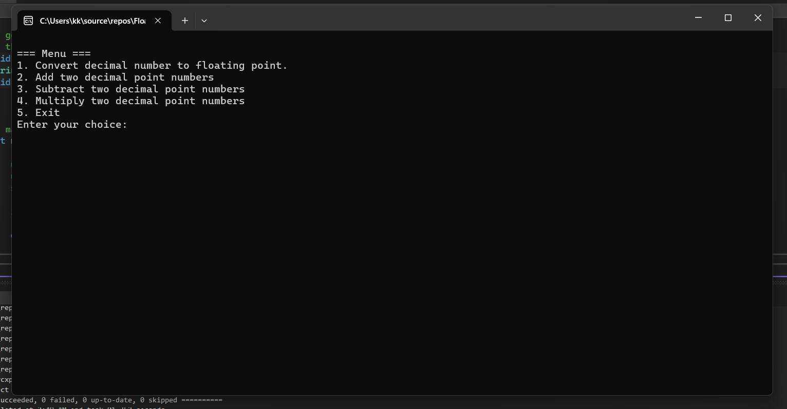
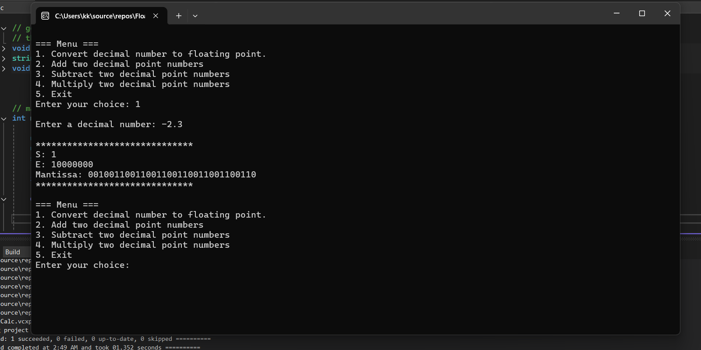
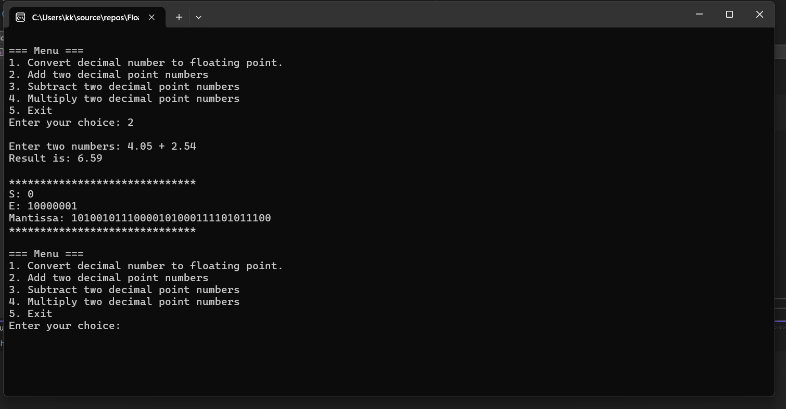
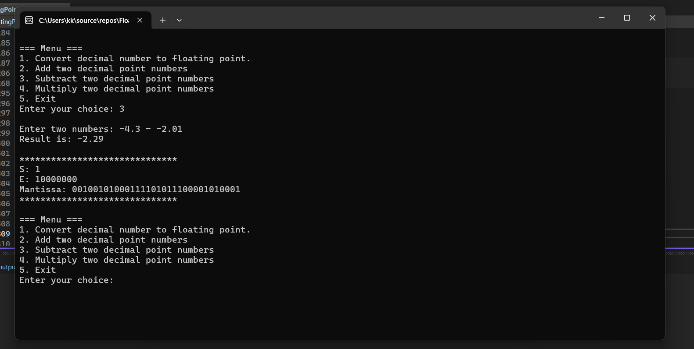
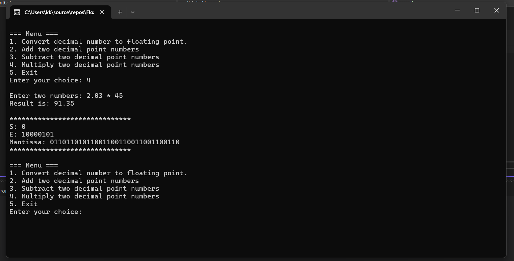

Software-Based Floating Point Calculator and Converter  
Personal Project, C++

A personal project built in C++ that implements a command-line floating point calculator and converter — entirely without using the CPU’s floating point unit. This calculator performs addition, subtraction, and multiplication using integer arithmetic, bitwise operations, and manual construction of IEEE 754 floating point representations. This project demonstrates a deep understanding of low-level numerical computation by simulating floating point behavior from scratch. It parses decimal input, separates whole and fractional parts, and constructs floating point representations using bit manipulation and binary normalization.

- Option 1: Enter any decimal number and convert it to IEEE 754 floating point format. The whole part is shifted until it becomes 1, and the mantissa and exponent are extracted manually.
- Option 2: Enter two decimal numbers. The whole and fractional parts are parsed separately, added using integer math, and converted to floating point format.
- Option 3: Similar to Option 2, but performs subtraction.
- Option 4: Parses and multiplies the whole and fractional parts separately, then converts the result to floating point format.
- No FPU Used: All operations are performed manually using integer math and bitwise logic — no reliance on the CPU’s floating point unit.

Key Highlights
- Implemented custom floating point operations using integer arithmetic and bitwise logic.
- Parsed and normalized binary representations of floating point numbers manually.
- Designed modular functions for arithmetic operations and rounding behavior.
- Enabled precise calculations from the command line with full control over internal representation.
- Simulated mantissa extraction, exponent shifting, and sign bit handling to mimic IEEE 754 format.

Skills Demonstrated
- Low-level programming and bit manipulation
- Numerical methods and floating point theory
- C++ command-line application development
- Debugging and performance optimization
- Understanding of binary normalization and rounding techniques

Learning Outcomes
This project helped reinforce:
- How floating point numbers are represented in memory
- The challenges of precision and rounding in numerical computing
- The power of bitwise operations in simulating hardware-level behavior
- How to build robust CLI tools with modular design

Future Improvements
- Add support for division and edge cases like overflow/underflow
- Implement rounding modes (e.g., round-to-nearest, round-toward-zero)
- Extend to support double-precision (64-bit) floating point format
